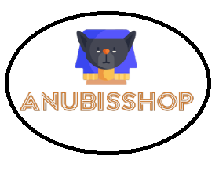

# Anubisshop ⌨️

_En la actualidad, las mascotas, en especial perros y gatos son tenidos en cuenta como miembros de las familias argentinas, y así mismo, su cuidado y alimentación es cada vez más importante a tener en cuenta dentro de los gastos del mes; esto es debido a la fidelidad, compañía, aportes en aprendizaje de niños y adultos, protección, entre otros factores,que simboliza el animal._

_Dado lo anterior, para los cuidados y alimentación necesaria de perros y gatos, se toma la decisión de realizar el proyecto de la creación de una tienda de mascotas online, la cual se llamara ANUBISSHOP, donde contará con todo tipo de alimento seco y húmedo, así mismo, accesorios en general como juguetes, productos de aseo, collares, tazas de comida, cepillos, entre otros; la venta será vía online. El sitio va dirigido a todo público. En especial a los dueños de mascotas._

## Inspiración en referentes del mercado 📋

_5 sitios de referencia indicando brevemente por qué fueron elegidos_

* [www.ondamascotera.com.ar](https://www.ondamascotera.com.ar/) - Vende accesorios y su pagina es muy vistosa.
* [www.dudimascotas.com.ar](https://www.dudimascotas.com.ar/) - Es una pagina dirigida a nuestro proyecto.
* [www.puppis.com.ar](https://www.puppis.com.ar/) - Es una pagina muy divertida y esta dirigida a nuestra idea.
* [www.tiendademascotas.com.a](https://www.tiendademascotas.com.ar/) - Es una pagina que esta dirigida a nuestra idea.
* [www.catycan.com](https://www.catycan.com/) - Es una pagina muy divertida y con muchas ideas para nuestro proyecto.

## Autores ✒️
_Los integrantes del grupo 10 de la comision 13:_

* [**Choque, Jeancarlos Sebastian:**] - *Tengo 22 años,ando estudiando programación actualmente, soy una persona que está relajada y trabajo de masajista independiente. Es mi primer proyecto en grupo acerca de programación, espero ser de ayuda y poder ayudar.*
* [**Chosgo, Selena:**] -*Tengo 22 años, soy una persona paciente y capaz de adaptarme a diferentes situaciones, este es mi primer proyecto a desarrollar en grupo con los conocimientos de programación adquiridos.*-
* [**Díaz, Jhan:**] - *Soy de Venezuela, tengo 43 años. Me encanta aprender; y esta experiencia me va ayudar a cumplir mi meta de ser programador de redes.*

## Trello ⚙️
_Sitio trello_

* [www.trello.com](https://trello.com/b/6vioLGJR/sprints) - Tableros de trabajo del equipo.